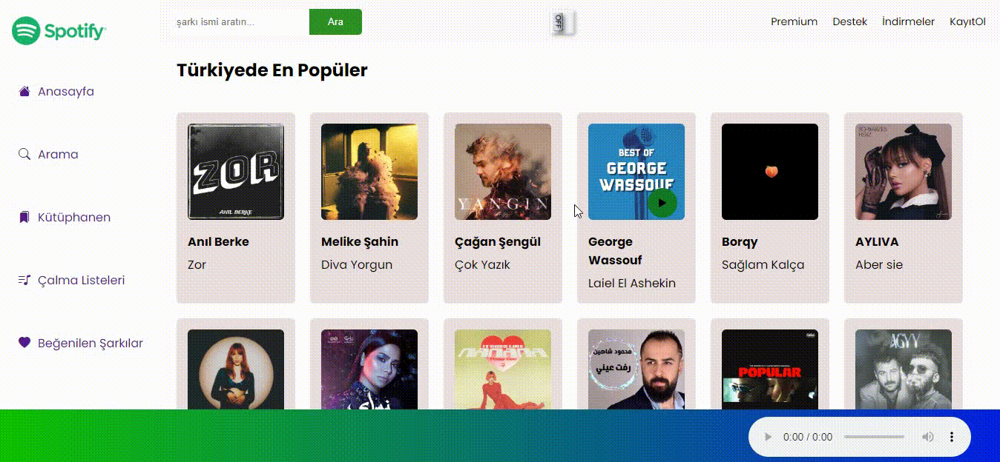

# Müzik Projesi

Bu proje, Shazam API'sini kullanarak müzikleri tanımlamak ve oynatmak için geliştirilmiş bir uygulamadır. Ayrıca, kullanıcı deneyimini geliştirmek için karanlık ve açık tema modları, müzik filtreleme özelliği ve görsel iyileştirmeler sunar.

## Özellikler

- Shazam API entegrasyonu ile müzik tanıma ve oynatma.
- Karanlık ve açık tema modları arasında geçiş yapabilme.
- Müzikleri filtreleme özelliği ile istenilen kriterlere göre sıralama.
- Kullanıcı dostu arayüz ve görsel iyileştirmeler.

## Kurulum

1. Proje deposunu bilgisayarınıza klonlayın.

Elbette, aşağıda müzik projesi için oluşturabileceğiniz bir readme.md içeriği örneği bulabilirsiniz. Bu içerik, projenizin amacını, kullanımını ve özelliklerini anlatarak potansiyel kullanıcılara ve geliştiricilere rehberlik edebilir.

markdown
Copy code
# Müzik Projesi

Bu proje, Shazam API'sini kullanarak müzikleri tanımlamak ve oynatmak için geliştirilmiş bir uygulamadır. Ayrıca, kullanıcı deneyimini geliştirmek için karanlık ve açık tema modları, müzik filtreleme özelliği ve görsel iyileştirmeler sunar.

## Özellikler

- Shazam API entegrasyonu ile müzik tanıma ve oynatma.
- Karanlık ve açık tema modları arasında geçiş yapabilme.
- Müzikleri filtreleme özelliği ile istenilen kriterlere göre sıralama.
- Kullanıcı dostu arayüz ve görsel iyileştirmeler.

## Kurulum

1. Proje deposunu bilgisayarınıza klonlayın.
git clone https://github.com/hasanyalsiz/spotify.git

## Katkıda Bulunma

1. Bu depoyu (`fork`) kendi GitHub hesabınıza kopyalayın.
2. Yeni özellikler eklemek veya hataları düzeltmek için değişiklikler yapın.
3. Yaptığınız değişiklikleri yeni bir dalda (`branch`) kaydedin.
4. Değişikliklerinizi açıklayan açıklamalar ekleyin ve dalınızı ana projenin dalına (`main`) göndermek için bir istek (`pull request`) oluşturun.

# Kaynaklar:

- API: https://rapidapi.com/apidojo/api/shazam
